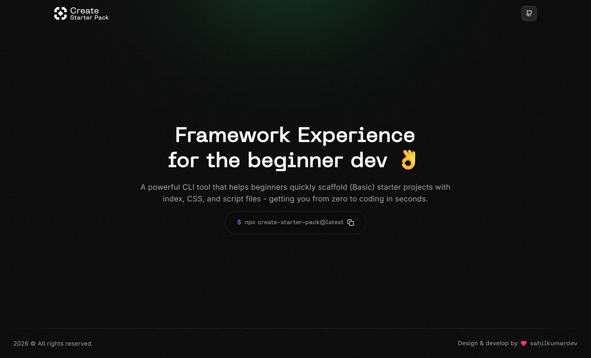

# Create Starter Pack - Website 🌐

[](https://pack.sahilkumardev.com)

A modern Next.js website showcasing the Create Starter Pack CLI tool. Built with cutting-edge technologies and featuring an interactive hero section with smooth animations.

## 🚀 Live Demo

Visit the live website: **[pack.sahilkumardev.com](https://pack.sahilkumardev.com)**

## 🛠️ Tech Stack

- **Framework:** [Next.js 16.1.1](https://nextjs.org/) with App Router
- **UI Library:** [React 19.2.3](https://react.dev/)
- **Styling:** [Tailwind CSS v4](https://tailwindcss.com/) 
- **UI Components:** [Radix UI](https://www.radix-ui.com/) + Custom components
- **Animations:** [Lenis](https://lenis.darkroom.engineering/) for smooth scrolling
- **Icons:** [Lucide React](https://lucide.dev/)
- **TypeScript:** Full type safety
- **Font:** Mono font family for CLI aesthetic

## 📁 Project Structure

```
web/
├── app/                    # Next.js App Router
│   ├── layout.tsx         # Root layout with metadata
│   ├── page.tsx          # Home page
│   ├── robots.txt        # SEO robots file
│   └── sitemap.ts        # Dynamic sitemap
├── components/            # React components
│   ├── ui/               # Reusable UI components
│   │   └── button.tsx    # Button component
│   ├── background.tsx    # Animated background
│   ├── hero-section.tsx  # Main hero with CLI demo
│   ├── max-width-wrapper.tsx  # Layout wrapper
│   ├── site-header.tsx   # Navigation header
│   └── site-footer.tsx   # Footer component
├── lib/                  # Utility functions
│   └── utils.ts         # Tailwind utilities
├── public/              # Static assets
│   ├── og-image.png     # Open Graph image
│   ├── favicon icons    # Various favicon formats
│   └── site.webmanifest # Web app manifest
├── styles/              # Global styles
│   └── globals.css      # Tailwind base styles
└── fonts/               # Custom font files
```

## ✨ Features

### 🎨 Design & UX
- **Dark Theme** - Modern dark interface
- **Responsive Design** - Mobile-first approach
- **Smooth Scrolling** - Lenis integration for buttery smooth scrolling
- **Interactive CLI Demo** - Click-to-copy command with visual feedback
- **Custom Logo** - SVG logo with geometric design
- **Hover Animations** - Subtle hover effects and transitions

### 🔧 Technical Features
- **Server-Side Rendering** - Next.js App Router with RSC
- **SEO Optimized** - Complete meta tags, Open Graph, Twitter Cards
- **Performance Optimized** - Optimized fonts, images, and code splitting
- **Accessibility** - ARIA labels and keyboard navigation
- **Progressive Web App** - Web manifest for installability

### 📱 Components

#### Hero Section (`hero-section.tsx`)
- Interactive CLI command demo
- Copy-to-clipboard functionality with visual feedback
- Animated icons (copy → checkmark)
- Responsive typography and spacing
- Hover effects with shadow and scale transforms

#### Site Header (`site-header.tsx`)
- Custom geometric logo
- GitHub repository link
- Fixed positioning with backdrop blur
- Mobile-responsive navigation

#### Background (`background.tsx`)
- Subtle animated background effects
- CSS-based animations for performance

## 🚀 Getting Started

### Prerequisites
- Node.js 18+ 
- pnpm (recommended) or npm

### Installation

```bash
# Clone the repository
git clone https://github.com/sahilkumardev/create-starter-pack.git

# Navigate to web directory
cd create-starter-pack/web

# Install dependencies
pnpm install

# Start development server
pnpm dev
```

Open [http://localhost:3000](http://localhost:3000) to view the website.

### Available Scripts

```bash
pnpm dev     # Start development server
pnpm build   # Build for production
pnpm start   # Start production server
pnpm lint    # Run ESLint
```

## 📊 SEO & Metadata

The website includes comprehensive SEO optimization:

- **Open Graph** tags for social media sharing
- **Twitter Card** integration
- **Structured data** for search engines
- **Sitemap** generation
- **Robots.txt** configuration
- **Favicon** in multiple formats
- **Web manifest** for PWA functionality

### Meta Tags Configuration
```typescript
export const metadata: Metadata = {
  title: "Starter Pack CLI",
  description: "A comprehensive starter pack CLI tool for quickly scaffolding web and development projects",
  openGraph: {
    images: [{ url: "/og-image.png" }],
  },
  // ... additional metadata
}
```

## 🎨 Styling Architecture

### Tailwind CSS v4
- Latest Tailwind CSS features
- Custom color scheme for dark theme
- Responsive design utilities
- Animation and transition classes

### Component Styling Pattern
```tsx
// Using clsx and tailwind-merge for conditional classes
className={cn(
  "base-classes",
  "hover:hover-classes",
  "responsive:md:classes",
  condition && "conditional-classes"
)}
```

## 🔗 External Links & Integrations

- **GitHub Repository:** Links to the main CLI repository
- **Author Website:** [sahilkumardev.com](https://sahilkumardev.com)
- **NPM Package:** `create-starter-pack`

## 📝 Environment Variables

No environment variables required for basic functionality. The website is designed to work out of the box.

## 🚀 Deployment

The website is optimized for deployment on:
- **Vercel** (recommended for Next.js)
- **Netlify**
- **GitHub Pages** (with static export)
- Any hosting platform supporting Node.js

### Build Command
```bash
pnpm build
```

### Start Command  
```bash
pnpm start
```

## 🤝 Contributing

1. Fork the repository
2. Create your feature branch (`git checkout -b feature/amazing-feature`)
3. Commit your changes (`git commit -m 'Add amazing feature'`)
4. Push to the branch (`git push origin feature/amazing-feature`)
5. Open a Pull Request

## 📄 License

This project is licensed under the MIT License - see the [LICENSE](../LICENSE) file for details.

## 👨‍💻 Author

**Sahil Kumar Dev**
- Website: [sahilkumardev.com](https://sahilkumardev.com)
- Twitter: [@sahilkumardev](https://twitter.com/sahilkumardev)
- GitHub: [@sahilkumardev](https://github.com/sahilkumardev)

---

Made with ❤️ to showcase the Create Starter Pack CLI tool